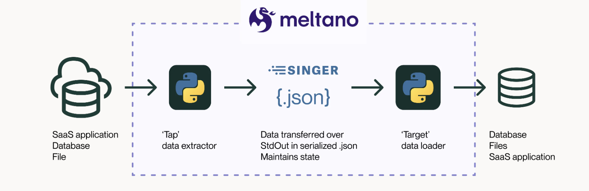
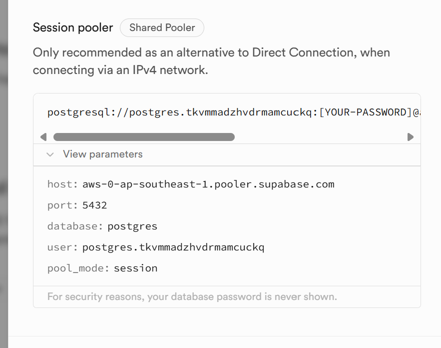

# Lesson

## Brief

### Preparation

Create the conda environment based on the `environment.yml` file. We will also be using google cloud (for which the account was created in the previous unit) in this lesson.

### Lesson Overview

Due to the rise of cloud data warehouse, data pipelines and ingestion model has shifted from Extract, Transform and Load (ETL) to Extract, Load and Transform (ELT), as alluded to in the previous unit. We learnt about the _Transform_ part in unit 2.5, as well as the _Extract_ (data extraction and web scraping) in unit 2.4.

In this lesson, we will instead use a framework (and platform) called `Meltano` which handles the end-to-end data pipeline, from **ingestion** (_Extract_ and _Load_), to _Transform_ via `Dbt` once the data is loaded into the data warehouse.

We will also learn about an orchestration framework called `Dagster`. Data orchestration is the process of automating the data pipeline, including scheduling, monitoring, and alerting. `Dagster` is an open-source data orchestration framework for data engineering, data science, and machine learning pipelines.


## Initial Set up

Ensure you have conda setup. Please do:

```
conda env update -f environment.yml
```

This should install the `elt` conda environment. You can activate it via:

```
conda activate elt
```

Lastly, one more step to install the packages:

```
pip install -r requirements.txt
```

Also - please ensure you have a Google cloud setup for GCP as well as installed the gcloud CLI:

https://cloud.google.com/sdk/docs/install 

---

## Part 1 - Hands-on with ELT

### Background

In the late 2010s, numerous companies and open-source initiatives emerged to address the challenge of ELT in the burgeoning world of SaaS. They sought to streamline the process of assimilating data from multiple SaaS platforms into a unified warehouse for analysis, mainly for Business Analytics purposes.

A standout open-source solution for ELT was `Singer`. Its core idea was straightforward: you could create any data extraction program, such as a basic Python script using requests, to retrieve data from a source. Similarly, you could design any data loading program to deposit this data into destinations like MySQL, Redshift, Snowflake, Databricks, Azure Synapse, Duck DB, and others. As long as your extraction tool (termed a 'tap') and your loading tool (labeled a 'target') were compliant with the serialized JSON format set by Singer, you could effortlessly transfer the data from the tap to the target using a single command.

Beyond this, the Singer.io framework offered additional functionalities, including the ability to set up a catalog.py to choose the data for replication, a STATE JSON blueprint for retaining details across tap usages, and a configuration file containing essential details like credentials to extract data from the source.

With this standard in place, any data enthusiast could contribute a tap or target to the shared open-source repository.

In 2018, the project was rebranded as `Meltano`. Building on the original Singer specification, Meltano added an SDK for building new integrations, a configuration wrapper, and an integrations Hub to support the community of Singer users. At the time of writing, the Meltano Hub offers over 550 integrations.



### Create a Meltano Project

We will create a Meltano project and use it to

1. extract data from Github and load it into a BigQuery dataset.
2. extract data from a Postgres database and load it into a BigQuery dataset.

We will treat the BigQuery dataset as our data warehouse. The 2 tasks above are typical data ingestion pipelines, which extract data from external and internal sources and load them into a data warehouse.

To create a Meltano project, run:

```bash
meltano init meltano-ingestion
cd meltano-ingestion
```

### Add an Extractor to Pull Data from Github

We're going to add an extrator for GitHub to get our data. An extractor is responsible for pulling data out of any data source.
We will use the `tap-github` extractor to pull the _releases_ of `pandas` library from Github. This will be a replication of what we did in unit 2.4.

To add the extractor to our project, run (make sure you are in the `meltano-ingestion` folder!):

```bash
meltano add extractor tap-github
```

Next, configure the extractor by running:

```bash
meltano config tap-github set --interactive
```

You will be prompted to enter many options, we just need to enter the following:

- `auth_token`: Please use the same auth token (ie. personal access token) you created for your own Github repo during earlier lesson
- `repositories`: `["pandas-dev/pandas"]`

This will add the configuration to the `meltano.yml` file, and the secret auth token to the `.env` file. Note that if you want to set them programatically, you can refer to: https://hub.meltano.com/extractors/tap-github/ 

Now that the extractor has been configured, it'll know where and how to find your data, but won't yet know which specific entities and attributes (tables and columns) you're interested in.

By default, Meltano will instruct extractors to extract all supported entities and attributes, but we're going to select specific ones for this tutorial. Find out what entities and attributes are available:

```bash
meltano select tap-github --list --all
```

If you recall from unit 2.4, we are interested in the `releases` entity, with the following attributes:

- `tag_name`
- `body`
- `published_at`

To select the entities and attributes, run:
see: https://docs.meltano.com/guide/integration#selecting-entities-and-attributes-for-extraction 

```bash
meltano select tap-github releases tag_name
meltano select tap-github releases body
meltano select tap-github releases published_at
```

### Add a Dummy Loader to Dump Data into JSON

We add a JSON target to test our pipeline. The JSON target will dump the data into a JSON file.

```bash
meltano add loader target-jsonl --variant=andyh1203
```

### Test Run Github to JSON

We can now test run the pipeline to see if it works.

```bash
meltano run tap-github target-jsonl
```

The extracted data will be dumped into a JSON file in the `output/` directory.

You can find the above tutorial here: https://docs.meltano.com/getting-started/part1/#select-entities-and-attributes-to-extract

### Add a Loader to Load Data into BigQuery

Before we can load the data into BigQuery, let's create a new project called `meltano-learn`. Then create a dataset in BigQuery called `ingestion` (multi-region: US).

Finally, create a service account with the `BigQuery Admin` role and download the JSON key file to your local machine.

We will now add a loader to load the data into BigQuery.

```bash
meltano add loader target-bigquery
```

```bash
meltano config target-bigquery set --interactive
```

Set the following options:

- `project`: *your_gcp_project_id_for_meltano_learn_project*
- `dataset`: `ingestion`
- `credentials_path`: _full path to the service account key file_
- `method`: `batch_job`
- `denormalized`: `true`
- `flattening_enabled`: `true`
- `flattening_max_depth`: `1`

### Run Github to BigQuery

We can now run the full ingestion (extract-load) pipeline.

```bash
meltano run tap-github target-bigquery
```

You will see the logs printed out in your console. Once the pipeline is completed, you can check the data in BigQuery.

### Add an Extractor to Pull Data from Postgres (Supabase)

We will use the `tap-postgres` extractor to pull data from a Postgres database hosted on [Supabase](https://supabase.com). 

> Supabase is an open-source backend-as-a-service platform that provides a suite of tools for building applications powered by PostgreSQL (Postgres) as its database. Postgres is a powerful, object-relational database system known for its reliability, extensibility and compliance with SQL standards. Supabase simplifies database management by offering an intuitive interface to interact with Postgres, making it a popular choice for developers looking for a scalable and flexible backend solution.

Go to the [Supabase](https://supabase.com) and create an account. Download the HDB housing data `Resale*.csv` file from the `data/` folder. Follow the instructions in this [setup file](supabase_db_setup_hdb.md) to setup your Postgres database table with the HDB housing data of resale flat prices based on registration date from Jan-2017 onwards. It is the same data that we used in module 1.

From Supabase, take note of your connection details from the Connection window, under Session Spooler:



We're going to add an extrator for Postgress to get our data. An extractor is responsible for pulling data out of any data source. We will use the `tap-postgress` extractor to pull data from the Supabase server. 

Create a new Meltano project by running:

```bash
meltano init meltano-resale
cd meltano-resale
```
To add the extractor to our project, run:

```bash
meltano add extractor tap-postgres
```

Next, configure the extractor by running:

```bash
meltano config tap-postgres set --interactive
```

Configure the following options:

- `database`: `postgres`
- `filter_schemas`: `['public']`
- `host`: `aws-0-ap-southeast-1.pooler.supabase.com` *(example)*
- `password`: *database password*
- `port`: `5432`
- `user`: *postgres.username*

> 1. Inspect the table schema and data using DBeaver.
> 2. Add the `tap-postgres` extractor to the Meltano project.
> 3. Configure the extractor interactively with the connection details above (also set the `filter_schemas`). (i.e '["public"]')
> 4. Create a dataset in BigQuery called `resale` (multi-region: US).
> 5. Configure target interactively similar to above - for `dataset`, set as `resale`. 
> 6. Run the pipeline with the `target-bigquery` loader (It will take about 25 mins to complete due to the large amount of data.)

Test your configuration:

```bash
meltano config tap-postgres test
```
We will now add a loader to load the data into BigQuery.

```bash
meltano add loader target-bigquery
```

```bash
meltano config target-bigquery set --interactive
```

Set the following options:

- `project`: *your_gcp_project_id_for_meltano_learn_project*
- `dataset`: `resale`
- `credentials_path`: _full path to the service account key file_
- `method`: `batch_job`
- `denormalized`: `true`
- `flattening_enabled`: `true`
- `flattening_max_depth`: `1`

### Run Github to BigQuery

We can now run the full ingestion (extract-load) pipeline.

```bash
meltano run tap-postgres target-bigquery
```

It will take about 25 mins to complete due to the large amount of data. You will see the logs printed out in your console. Once the pipeline is completed, you can check the data in BigQuery.


### Create Dbt project

Let's create a Dbt project to transform the data in BigQuery.

First, activate the conda environment from unit 2.5.

```bash
conda activate dwh
```

Then create a new dbt project.

```bash
dbt init resale_flat
```

Fill in the required config details.

### Create source and models

We can start to create the source and models in the dbt project.

> 1. Create a `source.yml` which points to the `ingestion` schema and `resale_flat_prices_from_jan_2017` table.
> 2. Create a `prices.sql` model (materialized table) which selects all columns from the source table, cast the `floor_area_sqm` to numeric, then add a new column `price_per_sqm` which is the `resale_price` divided by `floor_area_sqm`.
> 3. Create a `prices_by_town_type_model.sql` model (materialized table) which selects the `town`, `flat_type` and `flat_model` columns from `prices`, group by them and calculate the average of `floor_area_sqm`, `resale_price` and `price_per_sqm`. Finally, sort by `town`, `flat_type` and `flat_model`.

### Run Dbt

Run the dbt project to transform the data.

```bash
dbt run
```

You should see 2 new tables in the `resale_flat` dataset.

---

## Part 2 - Hands-on with Orchestration I

### Background

`Dagster` is a data orchestrator for machine learning, analytics, and ETL. It lets you define pipelines in terms of the data flow between reusable, logical components, then test locally and run anywhere. With a unified view of pipelines and the assets they produce, Dagster can schedule and orchestrate Pandas, Spark, SQL, or anything else that Python can invoke.

### Create a Dagster Project

First, reactivate the conda environment.

```bash
conda activate elt
```

To create a new Dagster project:

```bash
dagster project scaffold --name dagster-orchestration
```

After running this command, you should see a new directory called `dagster-orchestration` in your current directory. This directory contains the files that make up your Dagster project. Next, add the following dependencies to the `setup.py` file:

- `requests` will be used to download data from the internet
- `pandas` is a popular library for working with tabular data
- `matplotlib` makes it easy to make charts in Python
- `dagster_duckdb` manages how Dagster can read and write to DuckDB
- `dagster_duckdb_pandas` allows loading data from DuckDB into Pandas DataFrames

Then install the Python dependencies by:

```bash
cd dagster-orchestration
pip install -e ".[dev]"
```

### Introduction to Software-Defined Assets, Pipelines, Jobs and Schedule

In Dagster, the main way to create data pipelines is by writing `Software-Defined Assets` (SDA). You can connect assets together (that depend on each other) to form a pipeline. An asset is a logical unit of data that can be produced or consumed by a pipeline. Assets can be any type of object, e.g.

- A database table or view
- A file, such as in your local machine or object storage like Google Cloud Storage
- A machine learning model

In this project, we will create 2 assets:

- `pandas_releases` - make a request to Github API to get the releases of `pandas` library, then load the data into a Pandas DataFrame
- `summary_statistics` - calculate the summary statistics of the `pandas_releases` DataFrame

You can specify the dependencies between assets to define a pipeline. In our pipeline, the `summary_statistics` asset depends on the `pandas_releases` asset.

A `job` lets you target a selection of assets to materialize them together as a single action. Assets can also belong to multiple jobs.

After defining a job, it can be attached to a `schedule`. A schedule's responsibility is to start a run of the assigned job at a specified time.

### Introduction to I/O Managers

Dagster uses I/O managers to manage how data is read from and written to assets. I/O stands for input and output. They manage input by reading an asset from where it’s stored and loading it into memory to be used by a dependent asset. They control output by writing the assets to the location configured.

We will configure an I/O manager for reading/writing to database (file to storage and others are also supported).

### Create Assets and Definitions

We will now create the assets and definitions for our pipeline.

Replace the content in `dagster-orchestration/dagster_orchestration/assets.py` with the below. Also you need to replace `<YOUR-GITHUB-PERSONAL-ACCESS-TOKEN>` with your Github personal access token.

```python
import base64
from io import BytesIO
from typing import Dict

import matplotlib.pyplot as plt
import pandas as pd
import requests
from dagster import AssetExecutionContext, MetadataValue, asset


@asset
def pandas_releases(
    context: AssetExecutionContext,
) -> pd.DataFrame:
    access_token = "<YOUR-GITHUB-PERSONAL-ACCESS-TOKEN>"
    response = requests.get(
        "https://api.github.com/repos/pandas-dev/pandas/releases?per_page=100",
        headers={
            "Accept": "application/vnd.github+json",
            "Authorization": f"Bearer {access_token}",
        },
    )

    releases_with_essential_fields = [
        {
            "version": release["tag_name"],
            "published_at": release["published_at"],
            "summary": release["body"],
        }
        for release in response.json()
    ]
    df = pd.DataFrame(releases_with_essential_fields)
    df["published_at"] = pd.to_datetime(df["published_at"])

    context.add_output_metadata(
        metadata={
            "num_records": len(df),
            "preview": MetadataValue.md(
                df.sort_values("published_at", ascending=False).head().to_markdown()
            ),
        }
    )

    return df  # return df and the I/O manager will save it


@asset
def summary_statistics(
    context: AssetExecutionContext,
    pandas_releases: pd.DataFrame,
) -> pd.DataFrame:
    counts = {
        "new_features": pandas_releases.summary.str.contains("feature").sum(),
        "bug_fixes": pandas_releases.summary.str.contains("bug").sum(),
        "performance_improvements": pandas_releases.summary.str.contains(
            "performance"
        ).sum(),
    }

    plt.figure(figsize=(10, 6))
    plt.bar(list(counts.keys()), list(counts.values()))
    plt.xticks(rotation=45, ha="right")
    plt.title("Count of Releases by Type in Pandas")
    plt.tight_layout()

    buffer = BytesIO()
    plt.savefig(buffer, format="png")
    image_data = base64.b64encode(buffer.getvalue())

    md_content = f"})"

    context.add_output_metadata(metadata={"plot": MetadataValue.md(md_content)})

    return pd.DataFrame(
        {"type": counts.keys(), "count": counts.values()}
    )  # return df and the I/O manager will save it
```

The first asset- `pandas_releases` makes a request to Github API (the same code we used in unit 2.4) to get the releases of `pandas` library, then load the data into a Pandas DataFrame. It also adds some metadata to the asset, which will be saved by the I/O manager.

The second asset- `summary_statistics` calculates the summary statistics of the `pandas_releases` DataFrame. It also adds a bar chart image to the asset, which will be saved by the I/O manager.

Replace the content in `dagster-orchestration/dagster_orchestration/definitions.py` with the following:

```python
from dagster import (
    AssetSelection,
    Definitions,
    ScheduleDefinition,
    define_asset_job,
    load_assets_from_modules,
)
from dagster_duckdb_pandas import DuckDBPandasIOManager

from . import assets

all_assets = load_assets_from_modules([assets])

# define the job that will materialize the assets
pandas_job = define_asset_job(name="pandas_job", selection=AssetSelection.all())

# a ScheduleDefinition the job it should run and a cron schedule of how frequently to run it
pandas_schedule = ScheduleDefinition(
    name="pandas_schedule",
    job=pandas_job, 
    cron_schedule="0 0 * * *"  # every day at midnight
)

database_io_manager = DuckDBPandasIOManager(database="analytics.pandas_releases")

defs = Definitions(
    assets=all_assets,
    jobs=[pandas_job],
    schedules=[pandas_schedule],
    resources={
        "io_manager": database_io_manager,
    },
)
```

Dagster definitions are entities that Dagster learns about by importing your code. There are a variety of definitions, including assets, jobs, schedules, sensors, and more.

Managing one type of definition, such as assets, is easy. However, it can quickly become unruly as your project grows to have a variety of definitions. To combine definitions and have them aware of each other, Dagster provides a utility called the `Definitions` object.

### Run the pipeline

Let's launch the Dagster UI, which allows us to explore the data assets, manually launch runs of the pipeline, and view the results of past runs.

```bash
dagster dev
```

Then open the UI at http://localhost:3000.

To materialize an asset means to create or update it. Dagster materializes assets by executing the asset's function or triggering an integration. Navigate to Jobs -> `pandas_job`, there you will see the pipeline (dependency between the assets). You can manually trigger the pipeline by clicking on the 'Materialize all' button in the upper right corner of the screen. This will create a Dagster run that will materialize your assets.

To follow the progress of the materialization and monitor the logs, each run has a dedicated page. To find the page:

- Click on the Runs tab in the upper navigation bar
- Click the value in the Run ID column on the table of the Runs page
- The top section displays the progress, and the bottom section live updates with the logs

The metadata of the asset are available under the respective assets name in the Overview tab of `pandas_job` or in the Assets tab. Click on the 'Show Markdown' to see the redered markdown or image.

You can also view the Job Schedule in the Schedules tab of `dagster_orchestration`. The schedule will run every day at midnight.
